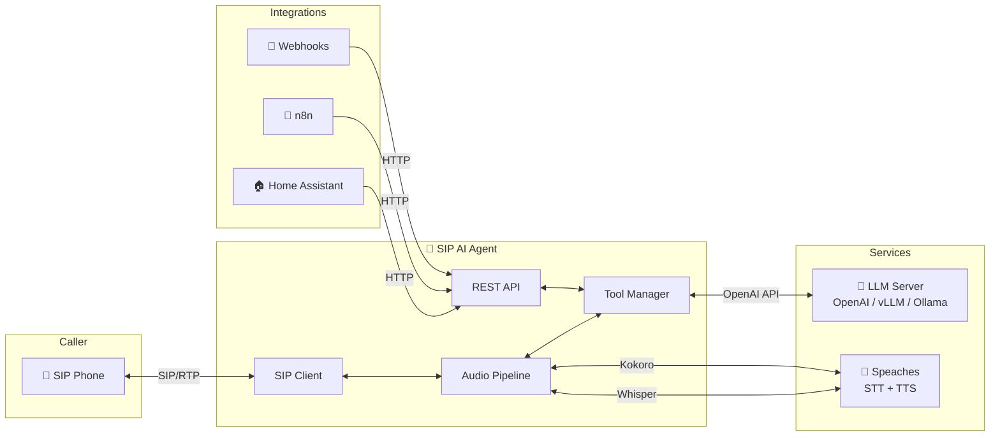

# 📞 SIP AI Assistant

> 🤖 **ROBO CODED** — This project was made with AI and may not be 100% sane. But the code does work! 🎉

A voice-powered AI assistant that answers phone calls, understands natural language, and performs actions like checking weather, setting timers, scheduling callbacks, and more.

[](https://www.gnu.org/licenses/agpl-3.0)
[](https://www.docker.com/)
[](https://www.python.org/)
[](https://www.nvidia.com/en-us/products/workstations/dgx-spark/)
[](https://sip-agent.readme.io)

📖 **[Read the Documentation](https://sip-agent.readme.io)**

---

## ✨ Features

| Feature | Description |
|---------|-------------|
| 🎙️ **Voice Conversations** | Natural speech-to-text and text-to-speech powered by Whisper & Kokoro |
| 🤖 **LLM Integration** | Connects to OpenAI, vLLM, Ollama, LM Studio, and more |
| 🔧 **Built-in Tools** | Weather, timers, callbacks, date/time, calculator, jokes |
| 🔌 **Plugin System** | Easily add custom tools with Python |
| 🌐 **REST API** | Initiate outbound calls, execute tools, manage schedules |
| ⏰ **Scheduled Calls** | One-time or recurring calls (daily briefings, reminders) |
| 🔗 **Webhooks** | Trigger calls from Home Assistant, n8n, Grafana, and more |
| 🗣️ **Custom Phrases** | Customize greetings, goodbyes, and responses via JSON or env vars |
| 📊 **Observability** | Prometheus metrics, OpenTelemetry tracing, structured JSON logs |

---

## 🏗️ Architecture



---

## 🚀 Quick Start

### Prerequisites

| Requirement | Description |
|-------------|-------------|
| 🐳 **Docker** | Docker and Docker Compose |
| 📞 **SIP Server** | FreePBX, Asterisk, 3CX, or any SIP PBX |
| 🧠 **LLM Server** | OpenAI API, vLLM, Ollama, or LM Studio |
| 🎤 **Speaches** | [Speaches](https://github.com/speaches-ai/speaches) for STT/TTS |

### Installation

```bash
# Clone the repository
git clone https://github.com/your-org/sip-agent.git
cd sip-agent

# Configure environment
cp sip-agent/.env.example sip-agent/.env
nano sip-agent/.env

# Start services
docker compose up -d
```

### Verify Installation

```bash
curl http://localhost:8080/health | jq
```

**Expected output:**

```json
{
  "status": "healthy",
  "sip_registered": true,
  "active_calls": 0
}
```

### Make a Test Call

```
┌────────────────────────────────────────────────────────────┐
│ 📞 INCOMING CALL                                           │
├────────────────────────────────────────────────────────────┤
│ 🤖 "Hello! Welcome to the AI assistant. How can I help?"  │
│ 👤 "What's the weather like?"                              │
│ 🤖 "At Storm Lake, it's 44 degrees with foggy conditions."│
│ 👤 "Set a timer for 5 minutes"                             │
│ 🤖 "Timer set for 5 minutes!"                             │
│ 👤 "Goodbye"                                               │
│ 🤖 "Goodbye! Have a great day!"                           │
└────────────────────────────────────────────────────────────┘
```

---

## ⚙️ Configuration

Create a `.env` file with your settings:

```env
# 📞 SIP Connection
SIP_USER=ai-assistant
SIP_PASSWORD=your-secure-password
SIP_DOMAIN=pbx.example.com

# 🎤 Speaches (STT + TTS)
SPEACHES_API_URL=http://speaches:8001

# 🧠 LLM Settings
LLM_BASE_URL=http://vllm:8000/v1
LLM_MODEL=openai-community/gpt2-xl

# 🌤️ Weather (Optional)
TEMPEST_STATION_ID=12345
TEMPEST_API_TOKEN=your-api-token
```

📖 See [Configuration Reference](https://sip-agent.readme.io/docs/configuration) for all options.

---

## 🌐 API Examples

### 📞 Make an Outbound Call

```bash
curl -X POST http://localhost:8080/call \
  -H "Content-Type: application/json" \
  -d '{
    "extension": "5551234567",
    "message": "Hello! This is a reminder about your appointment tomorrow."
  }'
```

**Response:**

```json
{
  "call_id": "out-1732945860-1",
  "status": "queued",
  "message": "Call initiated"
}
```

### 🌤️ Weather Call

```bash
curl -X POST http://localhost:8080/tools/WEATHER/call \
  -H "Content-Type: application/json" \
  -d '{
    "extension": "5551234567",
    "prefix": "Good morning! Here is your weather update."
  }'
```

### ⏰ Schedule Daily Weather Briefing

```bash
curl -X POST http://localhost:8080/schedule \
  -H "Content-Type: application/json" \
  -d '{
    "extension": "5551234567",
    "tool": "WEATHER",
    "at_time": "07:00",
    "recurring": "daily",
    "prefix": "Good morning!"
  }'
```

**Response:**

```json
{
  "schedule_id": "a1b2c3d4",
  "status": "scheduled",
  "scheduled_for": "2025-12-01T07:00:00-08:00",
  "recurring": "daily"
}
```

### 🔧 List Available Tools

```bash
curl http://localhost:8080/tools | jq '.[].name'
```

**Output:**

```
"WEATHER"
"SET_TIMER"
"CALLBACK"
"HANGUP"
"STATUS"
"CANCEL"
"DATETIME"
"CALC"
"JOKE"
```

---

## 🔧 Built-in Tools

| Tool | Description | Example Phrase |
|------|-------------|----------------|
| 🌤️ `WEATHER` | Current weather conditions | *"What's the weather?"* |
| ⏲️ `SET_TIMER` | Set a countdown timer | *"Set a timer for 5 minutes"* |
| 📞 `CALLBACK` | Schedule a callback | *"Call me back in an hour"* |
| 📴 `HANGUP` | End the call | *"Goodbye"* |
| 📋 `STATUS` | Check pending timers | *"What timers do I have?"* |
| ❌ `CANCEL` | Cancel timers/callbacks | *"Cancel my timer"* |
| 🕐 `DATETIME` | Current date and time | *"What time is it?"* |
| 🧮 `CALC` | Math calculations | *"What's 25 times 4?"* |
| 😄 `JOKE` | Tell a joke | *"Tell me a joke"* |
| 🦜 `SIMON_SAYS` | Repeat back verbatim | *"Simon says hello world"* |

---

## 🔌 Creating Plugins

Add custom tools by creating Python plugins:

```python
# src/plugins/hello_tool.py
from tool_plugins import BaseTool, ToolResult, ToolStatus

class HelloTool(BaseTool):
    name = "HELLO"
    description = "Say hello to someone"
    
    parameters = {
        "name": {
            "type": "string",
            "description": "Name to greet",
            "required": True
        }
    }
    
    async def execute(self, params):
        name = params.get("name", "friend")
        return ToolResult(
            status=ToolStatus.SUCCESS,
            message=f"Hello, {name}! Nice to meet you."
        )
```

Register in `tool_manager.py`:

```python
from plugins.hello_tool import HelloTool

tool_classes = [
    # ... existing tools ...
    HelloTool,
]
```

📖 See [Creating Plugins](https://sip-agent.readme.io/docs/plugins) for the full guide.

---

## 📊 Monitoring

### View Logs

```bash
# Docker logs
docker logs -f sip-agent

# Formatted log viewer
python tools/view-logs.py -f
```

**Example output:**

```
┌──────────────────────────────────────────────────────────────
│ 📞 CALL #1 - From: 1001
└──────────────────────────────────────────────────────────────
15:30:05  📞 Call started
15:30:06  👤 "What's the weather?"
15:30:07  🔧 [TOOL:WEATHER]
15:30:08  🤖 "At Storm Lake, it's 44 degrees..."
15:30:12  👤 "Thanks, goodbye"
15:30:13  📴 Call ended (duration: 0:08)
```

### Grafana Dashboard

Import the included dashboard:

```bash
grafana/dashboards/sip-agent.json
```

```
┌─────────────────────────────────────────────────────────────┐
│ 📊 SIP Agent Dashboard                                      │
├─────────────────────────────────────────────────────────────┤
│ 📞 Active Calls: 1        │ 📈 Total Today: 47             │
│ ⏱️ Avg Duration: 2m 34s   │ 🔧 Tool Calls: 23              │
│ 🎤 STT p95: 245ms         │ 🧠 LLM p95: 890ms              │
└─────────────────────────────────────────────────────────────┘
```

---

## 🗂️ Project Structure

```
sip-agent/
├── 📂 sip-agent/
│   ├── 📂 src/
│   │   ├── 📄 main.py              # Application entry
│   │   ├── 📄 config.py            # Configuration
│   │   ├── 📄 api.py               # REST API
│   │   ├── 📄 sip_client.py        # SIP handling
│   │   ├── 📄 audio_pipeline.py    # STT/TTS
│   │   ├── 📄 llm_engine.py        # LLM integration
│   │   ├── 📄 tool_manager.py      # Tool execution
│   │   └── 📂 plugins/             # Tool plugins
│   ├── 📄 Dockerfile
│   ├── 📄 .env.example
│   └── 📄 requirements.txt
├── 📂 tools/
│   └── 📄 view-logs.py             # Log viewer
├── 📂 grafana/
│   └── 📂 dashboards/              # Grafana dashboards
├── 📂 docs/                        # Documentation
├── 📄 docker-compose.yml
└── 📄 README.md                    # 👈 You are here
```

---

## 🖥️ Runs on NVIDIA DGX Spark

This project is optimized to run on the [NVIDIA DGX Spark](https://www.nvidia.com/en-us/products/workstations/dgx-spark/) with Grace Blackwell architecture.

```
┌─────────────────────────────────────────────────────────────┐
│ 🟢 NVIDIA DGX Spark                                         │
├─────────────────────────────────────────────────────────────┤
│ 🧠 Grace Blackwell GB10 Superchip                          │
│ 💾 128GB Unified Memory                                     │
│ ⚡ 1 PFLOP AI Performance                                   │
├─────────────────────────────────────────────────────────────┤
│ ✅ Local LLM inference (vLLM, Ollama)                      │
│ ✅ Local STT/TTS (Speaches + Whisper + Kokoro)             │
│ ✅ Real-time voice processing                               │
│ ✅ Multiple concurrent calls                                │
└─────────────────────────────────────────────────────────────┘
```

**Recommended DGX Spark setup:**

```env
# Run everything locally on DGX Spark
LLM_BASE_URL=http://localhost:8000/v1
LLM_MODEL=openai-community/gpt2-xl
SPEACHES_API_URL=http://localhost:8001
```

---

## 🐳 Docker Compose

```yaml
services:
  sip-agent:
    build: ./sip-agent
    network_mode: host  # Required for SIP/RTP
    environment:
      - SIP_USER=${SIP_USER}
      - SIP_PASSWORD=${SIP_PASSWORD}
      - SIP_DOMAIN=${SIP_DOMAIN}
      - SPEACHES_API_URL=${SPEACHES_API_URL}
      - LLM_BASE_URL=${LLM_BASE_URL}
      - LLM_MODEL=${LLM_MODEL}
    volumes:
      - ./data:/app/data
    restart: unless-stopped
    depends_on:
      - speaches

  speaches:
    image: ghcr.io/speaches-ai/speaches:latest
    ports:
      - "8001:8000"
    deploy:
      resources:
        reservations:
          devices:
            - driver: nvidia
              count: 1
              capabilities: [gpu]
```

---

## 📖 Documentation

**📚 Full documentation available at [sip-agent.readme.io](https://sip-agent.readme.io)**

| Document | Description |
|----------|-------------|
| [📖 Overview](https://sip-agent.readme.io/docs/overview) | Architecture and features |
| [🚀 Getting Started](https://sip-agent.readme.io/docs/getting-started) | Installation guide |
| [⚙️ Configuration](https://sip-agent.readme.io/docs/configuration) | Environment variables |
| [🌐 API Reference](https://sip-agent.readme.io/docs/api-reference) | REST API endpoints |
| [🔧 Built-in Tools](https://sip-agent.readme.io/docs/tools) | Available tools |
| [🔌 Creating Plugins](https://sip-agent.readme.io/docs/plugins) | Custom tool development |
| [📖 Examples](https://sip-agent.readme.io/docs/examples) | Integration patterns |

---

## 🤝 Contributing

Contributions are welcome! Please read our contributing guidelines first.

```bash
# Fork and clone
git clone https://github.com/your-username/sip-agent.git

# Create branch
git checkout -b feature/amazing-feature

# Make changes and test
docker compose up -d
python -m pytest

# Commit with emoji
git commit -m "✨ feat: add amazing feature"

# Push and PR
git push origin feature/amazing-feature
```

**Commit prefixes:**

| Prefix | Use |
|--------|-----|
| `✨ feat:` | New feature |
| `🐛 fix:` | Bug fix |
| `📚 docs:` | Documentation |
| `🔧 chore:` | Maintenance |
| `🎨 style:` | Formatting |
| `♻️ refactor:` | Refactoring |

---

## 📜 License

This project is licensed under the GNU Affero General Public License v3.0 - see the [LICENSE](LICENSE) file for details.

```
SPDX-License-Identifier: AGPL-3.0-or-later
```

---

## 🙏 Acknowledgments

- [NVIDIA DGX Spark](https://www.nvidia.com/en-us/products/workstations/dgx-spark/) — AI supercomputer platform
- [Speaches](https://github.com/speaches-ai/speaches) — Unified STT/TTS server
- [PJSIP](https://www.pjsip.org/) — SIP stack
- [FastAPI](https://fastapi.tiangolo.com/) — REST API framework
- [WeatherFlow Tempest](https://tempestwx.com/) — Weather data

---

## 📞 Support

| Resource | Link |
|----------|------|
| 📖 Docs | **[sip-agent.readme.io](https://sip-agent.readme.io)** |
| 🐛 Issues | [GitHub Issues](https://github.com/your-org/sip-agent/issues) |
| 💬 Discussions | [GitHub Discussions](https://github.com/your-org/sip-agent/discussions) |

---

<p align="center">
  Made with ❤️ and 🤖
</p>
